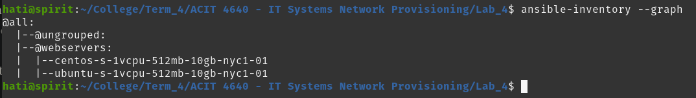

# Lab 4 for ACIT 4640

This repository uses ansible to configure a new "labuser" on Digital Ocean
virtual machines. The keys used to access the VMs are copied from root into
the new user, and sshd is configured to only allow access to the new user.

Then, "podman" is installed and used to pull and run a containerized version
of Ubuntu.

## Requirements
Two Digital Ocean VMs, one running Ubuntu or Debian, and the other running a RHEL OS. Tested using CentOS.

key-file to ssh into the VMs must be present at root of this repository.

Digital Ocean API key must be present in the environment variable.

Virtual Machines MUST have tags "Web" for playbook to work.



# How to test

The first playbook that should be run is the "create_user.ansible.yml". This is
the playbook responsible for configuring the user in the VMs.

```bash
ansible-playbook create_user.ansible.yml -u root
```

To test that the playbook worked successfully, try to ssh into the machines
first using the root user, and then using "labuser". You should be unable to
use root, but should be able to access it as "labuser".

The second playbook that should be run is the "install_podman.ansible.yml". This
is the playbook responsible for installing podman and running a Ubuntu container.

```bash
ansible-playbook install_podman.ansible.yml -u labuser
```

Afterwards, to check that the containers are running, ssh into the machines and run

```bash
podman ps
```
